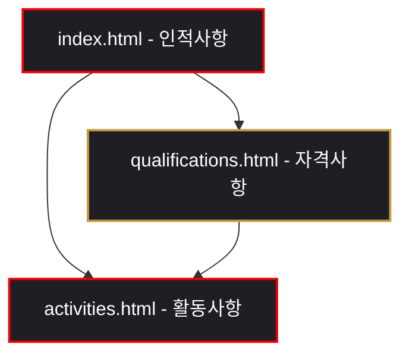

# ⚽ 성민혁 포트폴리오 웹사이트 개발 기록 (Development Record)

본 문서는 부산인력개발원 교육 수료 및 실무 준비생 **성민혁(Seong Min-hyuk)**의 개인 브랜드 및 역량을 효과적으로 소개하기 위해 제작된 포트폴리오 웹 서비스의 개발 기록입니다.

---

## 📌 1. 프로젝트 개요 (Project Overview)

*   **프로젝트명**: 성민혁 개인 포트폴리오 웹사이트
*   **개발 기간**: 2026년 진행 중
*   **개발 대상**: 웹 UI/UX 디자인 및 프론트엔드 퍼블리싱 역량 소개
*   **디자인 모토**: **"Victoria Concordia Crescit"** (조화 속의 승리 - 아스날 FC 모토)
*   **핵심 가치**: 협업과 소통, 사람의 마음을 읽는 공감 능력, 조화 속에서 발휘되는 시너지

---

## 🎨 2. 디자인 시스템 및 컨셉 (Design System & Concept)

### 💎 비주얼 아이덴티티 (Visual Identity)
좋아하는 축구 클럽인 **아스날 FC(Arsenal F.C.)**의 시각적 자산과 아이덴티티를 모던하게 재해석하여 프리미엄 다크 테마에 어우러지도록 설계했습니다.

*   **배경 및 레이아웃**: 우주와 경기장을 연상시키는 HSL 기반 다크 그라데이션 및 유리를 얹은 듯한 글래스모피즘(Glassmorphism) 효과 적용.
*   **핵심 컬러 (Crimson & Gold Accent)**:
    *   `Primary Text`: `#FAFAFA` (Off-White, HSL 240, 12%, 98%)
    *   `Accent Red`: `#EF0107` 계열 (Crimson Red, HSL 357, 85%, 52%) - 열정, 아스날 정체성
    *   `Accent Gold`: `#C59B3F` 계열 (Metallic Gold, HSL 43, 62%, 55%) - 프리미엄, 정교함, 영광
*   **타이포그래피**: 모던하고 세련된 영문 서체인 `Outfit`과 가독성이 높은 `Inter`를 Google Fonts를 통해 가져와 조화롭게 배치했습니다.

---

## 🛠️ 3. 기술 스택 (Tech Stack)

| 분류 | 기술 / 도구 | 상세 적용 내용 |
| :--- | :--- | :--- |
| **Publishing** | `HTML5`, `CSS3` | 시맨틱 웹 표준 준수, HSL 변수 활용 테마 설계, CSS Grid & Flexbox 반응형 레이아웃 |
| **Logic** | `Vanilla JavaScript` | ES6+ 문법, DOM 이벤트 핸들링, `IntersectionObserver` 기반 스크롤 반응 애니메이션 |
| **Graphics** | `Figma`, `Photoshop`, `SVG` | 벡터 로고 (`logo.svg`) 제작, UI/UX 와이어프레임 및 레이아웃 기획 |
| **Media** | `MP4 Video` | 히어로 섹션 백그라운드 영상 (`mv.mp4`) 도입으로 시각적 몰입도 향상 |
| **Collab** | `Git`, `Notion` | 일정 조율, 프로젝트 관리 및 문서화 습관 체계화 |

---

## 📂 4. 페이지 구조 및 주요 기능 (Page Architecture)

웹사이트는 사용자의 목적에 따라 직관적으로 탐색할 수 있도록 3개의 핵심 페이지로 구성되어 있습니다.



### 1️⃣ 메인 페이지 (`index.html` - 인적사항)
*   **히어로 섹션**: 배경에 재생되는 무음 반복 영상 (`mv.mp4`)과 골드/화이트 그라데이션 타이틀을 매칭하여 사이트 접속 시 프리미엄한 인상을 줍니다.
*   **간단 인적사항**: 성민혁의 기본 프로필 카드(이름, 식별코드, 사는 곳, 선호 클럽 등)를 글래스모피즘 카드로 표현.
*   **강점 및 극복 노력**: 
    *   *강점*: 뛰어난 공감, 경청, 조화로운 협업 역량 강조.
    *   *단점 보완*: 감정 표현 서투름 극복을 위한 피드백 세션 연습, 정리정돈 보완을 위한 Notion 및 칸반 보드 활용 내역 명시.

### 2️⃣ 역량 페이지 (`qualifications.html` - 자격사항)
*   **교육 이력 타임라인**: 고용노동부가 주관하고 부산인력개발원에서 진행하는 미래내일 일경험 사전직무교육 과정을 포함한 주요 이력을 타임라인 디자인으로 제공.
*   **보유 기술 매트릭스**: 
    *   *Design*: Figma UI/UX 기획(85%), 그래픽 디자인(80%), 인포그래픽(90%)
    *   *Development*: HTML5/CSS3 Layout(75%), JS DOM(65%), Responsive Web(70%)
    *   *Collaboration*: Git/GitHub(80%), Notion/Trello(85%), Teamwork(90%)
    *   페이지가 스크롤되어 요소가 나타날 때, 각 게이지 바가 목표 수치까지 부드럽게 늘어나는 **CSS/JS 애니메이션 인터랙션** 구현.
*   **자격증 현황**: 웹디자인기능사, 컴퓨터그래픽스운용기능사 취득 준비 상태 시각화.

### 3️⃣ 활동 및 프로젝트 페이지 (`activities.html` - 활동사항)
*   **아스날 테마 동물복지 캠페인**: 아스날 브랜드 에셋과 유기견/유기묘 보호를 결합한 캐릭터 브랜딩 및 동물복지 케어 센터 캠페인 기획서 다운로드 기능 (`pdf.pdf`).
*   **동물복지 5대 영역 대시보드 (Interactive Tab)**: 
    *   *영양, 정서, 행동, 건강, 생활 환경* 등 5가지 탭 버튼 클릭 시, 페이지 전환 없이 해당 정보 패널을 부드럽게 노출하는 **탭 스위처 기능**을 구현.
*   **캐릭터 마스코트 및 입양 연계**: 아스날 등번호를 단 캐릭터 마스코트 컨셉 소개와 입양 대기 고양이 '미미(MIMI)' 정보 카드 제공.

---

## ⚡ 5. 핵심 UI/UX 및 기술적 구현 (Key Implementations)

### ① 스크롤 리빌 애니메이션 (Scroll Reveal Effect)
사용자가 스크롤을 내릴 때 화면에 등장하는 카드, 제목, 타임라인 아이템들이 아래에서 위로 `20px` 올라오며 투명도가 부드럽게 변하도록 `IntersectionObserver`를 활용했습니다.
```javascript
const revealOnScroll = new IntersectionObserver((entries, observer) => {
  entries.forEach(entry => {
    if (entry.isIntersecting) {
      entry.target.style.opacity = '1';
      entry.target.style.transform = 'translateY(0)';
      observer.unobserve(entry.target);
    }
  });
}, { threshold: 0.1 });
```

### ② 반응형 모바일 네비게이션 (Mobile Hamburger Menu)
화면 크기가 작아지면 네비게이션 메뉴가 햄버거 토글 버튼으로 대체되며, 클릭 시 반투명 블러 배경 위에 슬라이드 형식으로 펼쳐지도록 반응형 스크립트를 내장했습니다.

---

## 🚀 6. 향후 개선 및 확장 계획 (Future Roadmap)

1.  **다크/라이트 모드 토글 기능 추가**: 시스템 설정에 맞추거나 사용자가 직접 선택할 수 있는 라이트 모드 지원.
2.  **프로젝트 갤러리 확장**: 향후 수료할 실무 프로젝트 및 코드 저장소 링크(GitHub Repository) 연동 강화.
3.  **반응형 레이아웃 미세조정**: 모바일 가로 모드 및 태블릿 해상도에서의 카드 그리드 배치 안정화.

---

*본 문서는 성민혁 님의 포트폴리오 사이트 제작 전반에 대한 소스 코드 구조 및 설계 방향을 정기적으로 기록하는 공식 개발 아카이브 파일입니다.*
